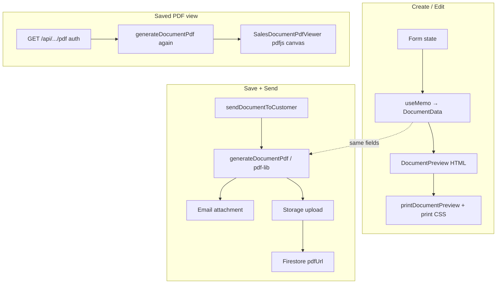

# Quotation & Invoice Preview / PDF

Practical guide for how quotes and invoices are previewed, generated, stored, emailed, and viewed.

Quotations and invoices share one pipeline (“sales documents”). Kind is `"quotation" | "invoice"` (alias `"quote"` → quotation). Layout is shared; only labels, accent colour, and deposit vs payment blocks differ by kind.

---

## Libraries

| Library | Where | Purpose |
|---------|--------|---------|
| **`pdf-lib`** | Server (`lib/generateDocumentPdf.ts`) | Generate A4 Quote / Tax Invoice PDF bytes |
| **`pdfjs-dist`** | Client (`components/documents/SalesDocumentPdfViewer.tsx`) | Render stored PDF pages on `<canvas>` in a viewer modal |
| Worker | `public/pdf.worker.min.mjs` | Copied from `pdfjs-dist` for the browser worker |

**Not used** for this flow: Puppeteer/Chromium HTML print, `jspdf`, `react-pdf`, `html2canvas`, `pdfmake`.

Supporting pieces:

- Firebase Storage + Firestore `pdfUrl` for persisted PDFs (on send)
- Auth API routes that return PDF bytes (avoid Storage CORS in the browser)
- Email attaches PDF bytes on send
- `printDocumentPreview()` + print CSS for the **live HTML** preview

Booking job reports still use Puppeteer in `lib/pdfService.ts`; that path is separate.

---

## Key files

| Path | Purpose |
|------|---------|
| `lib/documentData.ts` | Shared `DocumentData` view-model + formatting helpers (client-safe) |
| `lib/generateDocumentPdf.ts` | `generateDocumentPdf(data, kind)` via pdf-lib |
| `lib/salesDocumentPdf.ts` | Thin wrapper: `generateSalesDocumentPdf` → `generateDocumentPdf` |
| `lib/salesDocuments.ts` | CRUD, send/email, upload `pdfUrl`, PDF route handlers |
| `lib/printDocumentPreview.ts` | `printDocumentPreview()` for HTML preview print |
| `components/documents/DocumentPreview.tsx` | Live HTML preview (mirrors PDF layout) |
| `components/documents/SalesDocumentPdfViewer.tsx` | pdfjs canvas viewer modal |
| `components/DocumentCreatePage.tsx` | Tabs: create \| preview \| send |
| `components/DocumentDetailPanel.tsx` | List detail → open PDF viewer |
| `app/api/quotations|invoices/preview-pdf` | Optional server draft PDF (still available) |
| `app/api/quotations|invoices/[id]/pdf` | Admin PDF bytes |
| `app/api/book-now/sales-documents/[id]/pdf` | Customer portal PDF bytes |
| `app/globals.css` | Document preview styles + `@media print` for `[data-print-document-root]` |

---

## End-to-end overview



---

## 1. Live HTML preview (create / edit)

This is **not** a PDF file — it is styled HTML.

1. Form state → `useMemo` builds shared `DocumentData` in `DocumentCreatePage`.
2. Preview tab renders `<DocumentPreview data={documentData} />` (`data-print-document-root`).
3. Tabs: **Create | Preview | Send**.
4. **Print** calls `printDocumentPreview()`: adds `printing-document` on `body`, then `window.print()`. Print CSS hides everything except `[data-print-document-root]`.

HTML and PDF stay aligned because both consume the same `DocumentData` fields (labels/totals/deposit/payment).

---

## 2. Server PDF generation + storage

### Engine

```ts
generateDocumentPdf(data: DocumentData, kind?: "quotation" | "invoice" | "quote")
  → pdf-lib A4 pages
  → { buffer, filename }
```

`generateSalesDocumentPdf` in `lib/salesDocumentPdf.ts` is the compatibility entry used by `lib/salesDocuments.ts`.

### On send

1. Build `SalesDocPdfInput` / `DocumentData` from validated input + totals.
2. `generateSalesDocumentPdf` → PDF buffer.
3. Attach buffer to email (base64).
4. Upload to Storage: `sales-documents/{ownerUid}/{kind}/{documentId}/{code}.pdf`.
5. Persist `pdfUrl` on the document + customer notification.

Draft create/update without send does **not** upload a PDF.

### Download / portal APIs

`GET .../[id]/pdf` regenerates from Firestore via `buildPdfFromStoredDocument` → `generateSalesDocumentPdf`. They do **not** stream the stored GCS file (so the PDF reflects current fields, e.g. payment status). `pdfUrl` remains for notifications / links.

---

## 3. PDF viewer (pdfjs)

After save/send (or for any persisted id):

1. Client fetches bytes via authenticated API (`/api/quotations|invoices/[id]/pdf` or book-now equivalent).
2. `SalesDocumentPdfViewer` uses `pdfjs-dist` + `/pdf.worker.min.mjs` to draw each page on `<canvas>`.
3. Actions: download (Blob), print (hidden iframe + print), open in new tab, close.

Used from: create page (“View PDF”), list detail panel, customer book-now portal.

---

## 4. Quote vs invoice (preview / PDF only)

| Concern | Quotation | Invoice |
|---------|-----------|---------|
| Labels | Quote Date / Valid Until / Total Estimate | Invoice Date / Due Date / Total Due |
| Tagline | Quotation · BMS Pro | Tax Invoice · BMS Pro |
| Accent | Green | Blue |
| Extra block | Deposit requested + remaining balance | Amount paid + balance due |

Defined in `DOCUMENT_KIND_META` (`lib/documentData.ts`) and applied in both HTML preview and pdf-lib drawing.

---

## 5. API cheat sheet

| Method | Path | Auth | Behaviour |
|--------|------|------|-----------|
| `POST` | `/api/quotations/preview-pdf` | Admin Bearer | Draft PDF from body (pdf-lib) |
| `POST` | `/api/invoices/preview-pdf` | Admin Bearer | Same |
| `GET` | `/api/quotations/[id]/pdf` | Admin Bearer | Regenerate PDF |
| `GET` | `/api/invoices/[id]/pdf` | Admin Bearer | Same |
| `GET` | `/api/book-now/sales-documents/[id]/pdf?customerId&kind` | Customer id match | Regenerate PDF |

---

## Mental model

1. **`DocumentData`** is the single view-model for HTML + PDF.
2. **Create preview** = React HTML (`DocumentPreview`), print via CSS.
3. **Real PDF** = `pdf-lib` on the server (send, download, portal).
4. **View saved PDF** = auth API bytes → **pdfjs** canvases.
5. Change layout fields in `documentData` consumers together: `DocumentPreview.tsx` and `generateDocumentPdf.ts`.
