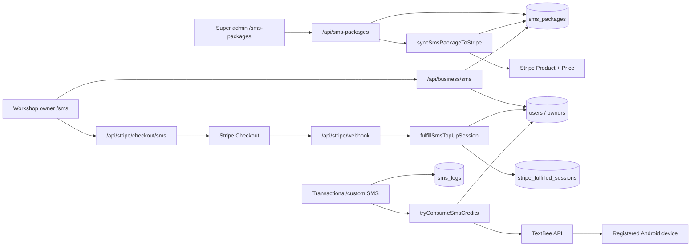

# SMS Packages — Architecture, Collections, Stripe and TextBee

This document describes the SMS credit-package system in the BMS Pro Black Admin Panel.
It covers package creation, Firestore data, Stripe top-ups, TextBee delivery, credit
enforcement, pages, APIs, and operational setup.

SMS packages also connect to subscription plans via optional `smsPackageId` on
`subscription_plans` (bundled credits that renew with the billing period). See
`subscription/readme/README.md` for plan create/edit and renewal behaviour. Top-ups
on `/sms` stay above the bundle and do not renew with the plan.

---

## Quick summary

| Concept | Location |
|---|---|
| SMS package catalog | Firestore `sms_packages/{packageId}` |
| Tenant SMS balance | Fields on `users/{ownerUid}` |
| Optional mirrored balance | Fields on `owners/{ownerUid}` |
| Delivery history | Firestore `sms_logs/{logId}` |
| Fulfilled Stripe top-ups | Firestore `stripe_fulfilled_sessions/{checkoutSessionId}` |
| Super admin package UI | `/sms-packages` |
| Super admin usage UI | `/sms-packages/usage` |
| Super admin SMS log | `/sms-packages/log` |
| Workshop owner top-up UI | `/sms` |
| Workshop owner SMS log | `/sms/log` |
| SMS gateway | TextBee API and registered Android device |
| Payment gateway | Stripe one-time Checkout |

There is no separate `sms_balances` collection. The live balance is stored on the
workshop owner's user document.

---

## How Firestore collections are created

Firestore collections do not need to be created manually. A collection appears when the
application writes its first document.

### Creating `sms_packages`

```text
Super admin opens /sms-packages
    → clicks Build New Package
    → submits the package form
    → POST /api/sms-packages
    → createSmsPackage()
    → adminDb().collection("sms_packages").doc().set(payload)
    → Firestore creates sms_packages/{autoGeneratedId}
```

Entry points:

- UI: `components/sms-packages-board.tsx`
- Form: `components/sms-package-build-modal.tsx`
- API: `app/api/sms-packages/route.ts`
- Firestore helpers: `lib/sms-packages/server.ts`
- Types: `lib/sms-packages/types.ts`

### Creating `sms_logs`

The first call to `appendSmsLog()` creates a document in `sms_logs`. Every sent,
failed, or skipped SMS attempt is logged.

### Creating `stripe_fulfilled_sessions`

After a successful SMS Stripe Checkout, fulfillment writes a document whose ID is the
Stripe Checkout Session ID. This is the top-up ledger and normal duplicate-fulfillment
guard.

---

## Firestore data model

### 1. `sms_packages` — package catalog

Path:

```text
sms_packages/{packageId}
```

Each document represents one one-time SMS credit package.

| Field | Type | Description |
|---|---|---|
| `name` | string | Package display name |
| `price` | number | Numeric one-time price in AUD |
| `priceLabel` | string | Display price, such as `AU$29 one-time` |
| `messageQuota` | number | Credits added after purchase; `-1` means unlimited |
| `description` | string | Package description |
| `features` | string[] | Feature bullets displayed on cards |
| `active` | boolean | Inactive packages cannot be purchased |
| `hidden` | boolean | Hidden packages are not shown to workshop owners |
| `popular` | boolean | UI highlight |
| `color` | string | UI color token |
| `icon` | string | Font Awesome icon class |
| `plan_key` | string/null | Optional internal key, e.g. `SMS_BASIC` |
| `stripeProductId` | string/null | Stripe Product ID |
| `stripePriceId` | string/null | Current Stripe Price ID |
| `createdAt` | timestamp | Creation time |
| `updatedAt` | timestamp | Last update time |

Example:

```text
sms_packages/abc123
  name: "100 SMS"
  price: 29
  priceLabel: "AU$29 one-time"
  messageQuota: 100
  active: true
  hidden: false
  plan_key: "SMS_BASIC"
  stripeProductId: "prod_..."
  stripePriceId: "price_..."
```

### 2. `users` — tenant SMS balance

Path:

```text
users/{ownerUid}
```

| Field | Description |
|---|---|
| `smsMessageLimit` | Total purchased/assigned credits; `-1` means unlimited |
| `smsMessagesUsed` | Number of reserved successful sends |
| `smsPackageId` | Most recently purchased package ID |
| `smsPackage` | Snapshot of the most recently purchased package |

Package snapshot:

```text
smsPackage:
  id
  name
  price
  priceLabel
  messageQuota
  plan_key
```

The remaining count is calculated, not stored:

```text
remaining = max(0, smsMessageLimit - smsMessagesUsed)
```

The same fields are mirrored to `owners/{ownerUid}` only when that owner document
exists. `users/{ownerUid}` is the source used for balance checks.

### 3. `sms_logs` — outbound SMS attempts

Path:

```text
sms_logs/{logId}
```

Typical fields:

```text
ownerUid
businessId
senderName
receiverPhone
receiverName
message
status          // sent, failed, skipped
statusDetail    // gateway_queued, quota_exceeded, invalid_recipient, etc.
source
createdAt
```

For TextBee, `gateway_queued` means the API accepted the message for processing by the
registered Android device. It does not by itself prove carrier delivery.

### 4. `stripe_fulfilled_sessions` — top-up ledger

Path:

```text
stripe_fulfilled_sessions/{stripeCheckoutSessionId}
```

Fields:

```text
sessionId
ownerUid
businessId
type: "sms_topup"
smsPackageId
smsPackageName
messageQuota
amountTotal
currency
fulfilledAt
```

The Checkout Session ID is used as the document ID so a normally repeated webhook or
success-page confirmation does not add the same package twice.

### 5. `stripe_events` — general webhook event ledger

The shared Stripe webhook stores processed Stripe event IDs in `stripe_events`. This is
used by the wider billing webhook, including the event that starts SMS top-up
fulfillment.

Typical fields:

```text
event_id
event_type
processed_at
```

### 6. `customers` — customer recipients for custom SMS

Path:

```text
customers/{customerId}
```

This is not an SMS balance collection. The custom-message feature reads it to build the
workshop owner's customer audience.

Relevant fields:

```text
ownerUid
status
phone / clientPhone / mobile
name / displayName / fullName / client
```

The recipient query:

- selects documents whose `ownerUid` matches the signed-in workshop owner;
- scans at most 2,000 customer documents;
- excludes customers whose status is `inactive`;
- removes records without a usable phone number;
- normalizes phone numbers to E.164; and
- removes duplicate phone numbers.

### 7. `users` — staff recipients for custom SMS

In addition to storing the owner's authoritative SMS balance, `users` is read to create
the custom-message staff audience.

Eligible staff:

- have the same `ownerUid` as the workshop owner;
- have role `staff` or `branch_admin`;
- are not suspended; and
- have a valid phone number.

The query scans at most 2,000 user documents. Customer and staff audiences are combined
and deduplicated by normalized phone number when the owner chooses **Both**.

### 8. `auditLogs` — custom-message audit record

Path:

```text
auditLogs/{auditLogId}
```

After a custom greeting/bulk send finishes, the system writes an audit entry with:

```text
ownerUid
action: "Custom SMS sent"
actionType: "other"
entityType: "customer"
performedBy
performedByName
performedByRole: "workshop_owner"
details
timestamp
createdAt
metadata:
  audience
  sent
  failed
  skipped
  total
  messagePreview
```

`messagePreview` stores only the first 120 characters. Individual recipient results are
stored in `sms_logs`; `auditLogs` stores the summary of the bulk action.

### 9. `customerPasswordResetCodes` — password-reset support

Path:

```text
customerPasswordResetCodes/{customerId}
```

The booking-engine password-reset flow writes:

```text
email
ownerUid
code
expiresAt
createdAt
used
```

This collection supports one SMS-producing workflow, but it is not part of package
balances or the SMS purchase ledger.

### Collection responsibility summary

| Collection | Created by | SMS purpose | Source of truth? |
|---|---|---|---|
| `sms_packages` | Super admin package CRUD | Purchasable package catalog | Yes, for package definitions |
| `users` | Existing account system | Owner balance and recipient lookup | Yes, for live SMS balance |
| `owners` | Existing owner system | Optional balance/customer-ID mirror | No |
| `sms_logs` | Every accepted, failed, or skipped send | Per-recipient delivery-attempt history | Yes, for SMS attempts |
| `stripe_fulfilled_sessions` | Paid top-up fulfillment | Purchase ledger and duplicate check | Yes, for fulfilled top-ups |
| `stripe_events` | Shared Stripe webhook | Processed webhook event ledger | Yes, for webhook events |
| `customers` | Customer management | Customer audience lookup | Yes, for customer details |
| `auditLogs` | Audit service | One summary record per custom bulk send | Yes, for audit history |
| `customerPasswordResetCodes` | Password-reset API | Reset code used by an SMS workflow | Yes, for reset codes |

Firestore creates each collection automatically when the first document is written.
Do not create empty collections manually.

---

## How package creation connects to Stripe

When Stripe is configured and an active, visible package is created:

```text
POST /api/sms-packages
    → createSmsPackage()
    → writes sms_packages/{packageId}
    → syncSmsPackageToStripe(packageId)
    → creates Stripe Product
    → creates Stripe Price in AUD
    → saves stripeProductId and stripePriceId on the package
```

When an existing package is edited:

```text
PUT /api/sms-packages
    → updateSmsPackage()
    → updates the existing Stripe Product
    → creates a new Stripe Price
    → saves the new stripePriceId
```

Stripe Prices are immutable for amount/currency, so editing a price creates a new Stripe
Price rather than modifying the old one.

If automatic Stripe synchronization fails, the package document still exists and the
failure is logged. A super admin can call:

```text
POST /api/sms-packages/sync-stripe
```

with the package ID to retry synchronization.

---

## Workshop owner purchase and fulfillment flow

```text
Owner opens /sms
    → GET /api/business/sms
    → reads users/{ownerUid} balance
    → lists active, non-hidden sms_packages
    → owner selects a package
    → POST /api/stripe/checkout/sms { packageId }
    → creates Stripe Checkout Session in mode "payment"
    → metadata includes type, ownerUid, firebaseUid and smsPackageId
    → owner completes Stripe payment
    → Stripe sends checkout.session.completed
    → /api/stripe/webhook detects metadata.type == "sms_topup"
    → fulfillSmsTopUpSession()
    → purchaseSmsPackageForBusiness()
    → adds messageQuota to users/{ownerUid}.smsMessageLimit
    → mirrors fields to owners/{ownerUid}, if present
    → writes stripe_fulfilled_sessions/{sessionId}
```

The success URL also contains `{CHECKOUT_SESSION_ID}`:

```text
/sms?checkout=success&session_id={CHECKOUT_SESSION_ID}
```

The owner page calls:

```text
POST /api/stripe/checkout/sms/confirm
```

This verifies that the session belongs to the tenant and is paid/complete, then safely
attempts fulfillment. It acts as a fallback when a webhook is delayed during local
development.

### How top-ups change the balance

For a normal package:

```text
nextLimit = currentLimit + package.messageQuota
```

Example:

```text
Before: smsMessageLimit = 300, smsMessagesUsed = 7, remaining = 293
Purchase: messageQuota = 100
After:  smsMessageLimit = 400, smsMessagesUsed = 7, remaining = 393
```

If `messageQuota` is `-1`, the tenant becomes unlimited. If the tenant is already
unlimited, purchasing a finite package leaves the tenant unlimited.

---

## How SMS credits are enforced

All billable sends should pass `ownerUid` to `sendSms()`.

```text
sendSms()
    → normalize recipient to E.164
    → validate message and TextBee configuration
    → tryConsumeSmsCredits(ownerUid, 1)
    → Firestore transaction reads users/{ownerUid}
    → if remaining < 1: skip with quota_exceeded
    → otherwise increment smsMessagesUsed
    → submit message to TextBee
    → if TextBee rejects/fails: release the reserved credit
    → append sms_logs document
```

Important:

- At zero remaining credits, the SMS is not submitted to TextBee.
- A skipped quota attempt is logged with `statusDetail: "quota_exceeded"`.
- If `ownerUid` is missing, the credit check is bypassed. Transactional workshop sends
  must therefore pass the correct owner UID.
- Unlimited tenants (`smsMessageLimit: -1`) are allowed to send without incrementing
  `smsMessagesUsed`.

Credit helpers:

- `lib/sms/usage.ts`
- `lib/sms/textbee.ts`
- Compatibility wrapper: `lib/smsService.ts`

### Exact balance calculation

The API derives the balance from `users/{ownerUid}`:

```text
limit = smsMessageLimit when it is a number; otherwise 0
used = smsMessagesUsed when it is a number; otherwise 0
unlimited = limit < 0
remaining = unlimited ? null : max(0, limit - used)
isLow = !unlimited && remaining < 20
```

Worked examples:

| Limit | Used | Remaining | Low? | Meaning |
|---:|---:|---:|---|---|
| `100` | `25` | `75` | No | 75 finite credits available |
| `20` | `0` | `20` | No | Threshold is strictly below 20 |
| `20` | `1` | `19` | Yes | Low-balance styling is shown |
| `10` | `15` | `0` | Yes | Remaining is clamped to zero |
| `0` | `0` | `0` | Yes | SMS sends are blocked |
| `-1` | any | `null`/Unlimited | No | No finite quota check |

Important rules:

- `remaining` is calculated at read time and is not stored as a Firestore field.
- `smsMessagesUsed` is cumulative. A top-up increases `smsMessageLimit`; it does not
  reset `smsMessagesUsed`.
- Any negative limit is treated as unlimited, although packages should use `-1`.
- Missing or non-numeric balance fields are treated as zero.
- A finite account reserves one credit before contacting TextBee.
- If TextBee rejects the request or the gateway call fails, the reserved credit is
  released.
- If TextBee accepts the request, the credit remains used even though carrier delivery
  has not yet been proven.

### Bulk/custom-message calculation

For a bulk send:

```text
requested recipients
    → remove missing/invalid phone numbers
    → normalize to E.164
    → remove duplicate phone numbers
    → valid unique recipients = total
    → send sequentially and consume one credit per accepted SMS
```

If only 12 credits remain and there are 20 valid unique recipients, the first 12 can be
queued and charged. The remaining 8 are skipped with `quota_exceeded`. Invalid numbers
removed before sending are not included in the result total and do not create SMS log
documents.

### Important credit-attribution requirement

Quota enforcement only runs when the caller supplies `ownerUid` to `sendSms()`. Most
tenant booking, reminder, customer-welcome, and custom-message flows do this correctly.
Some legacy/system send paths still omit it, so those sends are not charged to a tenant
and their logs have no tenant:

- workshop-owner welcome SMS;
- staff or branch-admin welcome SMS;
- additional-work quote SMS;
- booking-engine customer password-reset SMS;
- estimate-reply SMS; and
- some quotation/invoice customer-welcome calls.

New SMS workflows must always pass the workshop owner's UID unless the message is
intentionally system-funded.

---

## Low balance

Current threshold:

```text
SMS_LOW_BALANCE_THRESHOLD = 20
```

Defined in:

```text
lib/sms-packages/balance.ts
```

`isLow` is true when:

```text
remaining < 20
```

The owner UI shows the remaining count and low-balance styling. The threshold calculation
does not itself send an SMS, email, push notification, or in-app notification.

Current low-balance UI behavior:

- `/sms` displays **Low balance — consider topping up**;
- the workshop-owner sidebar displays the remaining count with warning styling;
- `SmsBalanceProvider` refreshes the owner's balance every 60 seconds; and
- successful top-up confirmation refreshes both `/sms` and the sidebar immediately.

There is currently no background low-balance job and no Firestore low-balance
notification document.

---

## TextBee connection

TextBee turns a registered Android phone into the outbound SMS gateway.

Flow:

```text
BMS Pro server
    → POST TextBee /gateway/devices/{deviceId}/send-sms
    → TextBee queues the message
    → registered Android device receives the job
    → Android SIM sends the SMS
    → mobile carrier processes delivery
```

Required setup:

1. Install and sign in to TextBee on an Android phone.
2. Register the phone in the TextBee dashboard.
3. Grant SMS and phone permissions.
4. Keep the phone online with an active SIM/SMS plan.
5. Add the API key and Device ID to server environment variables.

Phone numbers are normalized to E.164. The current configuration supports Sri Lanka
(`+94`) and Australia (`+61`).

---

## UI pages and features by role

### Super admin

#### `/sms-packages` — package management

- Card-based package catalog.
- Create a package with name, price, quota, description, features, color, icon and
  optional plan key.
- Edit existing packages.
- Activate/deactivate a package.
- Hide/show a package to workshop owners.
- Mark a package as popular.
- Display finite or unlimited message quota.
- Display the number of tenants linked to the latest package snapshot.
- Display **Stripe linked** or **Stripe not linked**.
- Delete a package after confirmation.
- Hover/transition effects on package cards and actions.

`inactive` packages cannot be purchased. `hidden` packages remain in the admin catalog
but are not returned to owners.

#### `/sms-packages/usage` — tenant usage and purchases

The **Tenant Usage** table shows:

- workshop name and email;
- total SMS limit;
- cumulative used count;
- calculated remaining count;
- `Unlimited` for negative limits;
- latest package name; and
- latest package message quota.

Features:

- search by workshop name or email;
- 15 workshops per client-side page;
- Previous/Next pagination; and
- a result range such as `Showing 1–15 of 42 workshops`.

The **Recent Stripe top-ups** table shows:

- fulfillment date/time;
- tenant/workshop name and email;
- package name;
- package message count; and
- amount and currency.

The API currently returns the latest 100 fulfilled SMS top-ups.

#### `/sms-packages/log` — all-tenant SMS log

- Displays up to the latest 200 SMS attempts across tenants.
- Adds a Tenant column with workshop name and email.
- Uses readable package/workshop/source labels instead of exposing internal IDs.
- Includes the shared log search, message expansion, status badges and 15-row
  pagination described below.

### Workshop owner (admin)

#### `/sms` — SMS credits and top-up

Balance cards show:

- **Remaining** — calculated credits or `Unlimited`;
- **Used** — cumulative reserved/accepted sends; and
- **Limit** — total credits assigned or purchased.

Top-up features:

- lists only active, non-hidden packages;
- displays package name, quota, price, description, features and popular badge;
- opens a confirmation modal before purchase;
- redirects to one-time Stripe Checkout when Stripe is configured;
- shows checkout cancellation and verification errors;
- shows **Applying your SMS credits…** while confirming a successful payment;
- updates the page balance immediately from the confirmation API response; and
- refreshes the sidebar balance after fulfillment.

When Stripe is not configured, development can apply a package directly. Direct top-up
is blocked when Stripe is configured.

#### `/sms/log` — workshop SMS log

- Displays only logs where `ownerUid` matches the signed-in workshop owner.
- Fetches up to the latest 100 attempts.
- Does not show the Tenant column.
- Includes search, status/source labels, message expansion and 15-row pagination.

#### `/owner-custom-messages` — custom and bulk SMS

- Audience options: Customers, Staff, or Both.
- Customer recipients come from active `customers` records with valid phone numbers.
- Staff recipients include active `staff` and `branch_admin` users.
- Live recipient count and customer/staff breakdown.
- Greeting and custom-message templates.
- `{name}` personalization for every recipient.
- Character countdown and maximum-length validation.
- Preview using a sample recipient name.
- Gateway-configuration warning.
- Confirmation dialog before the irreversible send.
- Sequential, per-recipient credit enforcement.
- Summary showing sent, failed, skipped and total counts.
- Up to five individual error messages in the result panel.
- Per-recipient `sms_logs` entries plus one summary `auditLogs` entry.

### Branch admin, staff and other roles

- Branch admins, staff and other roles do not receive SMS package/top-up/log navigation.
- `/sms` and `/sms/log` redirect non-workshop owners to `/dashboard`.
- `/owner-custom-messages` redirects branch admins to `/branches`.
- Business SMS APIs require `workshop_owner`.
- Branch admins can still perform normal booking actions that trigger transactional
  customer SMS; these are charged to the workshop owner when the workflow passes the
  correct `ownerUid`.

### Role and page summary

| URL | Super admin | Workshop owner | Branch admin/staff |
|---|---|---|---|
| `/sms-packages` | Manage package catalog | No access | No access |
| `/sms-packages/usage` | View all tenant usage/top-ups | No access | No access |
| `/sms-packages/log` | View cross-tenant logs | No access | No access |
| `/sms` | No owner view | View balance and buy credits | Redirected |
| `/sms/log` | Uses admin log page instead | View own logs | Redirected |
| `/owner-custom-messages` | No owner view | Send custom/bulk SMS | Redirected/no access |

---

## API routes

| Method | URL | Auth | Purpose |
|---|---|---|---|
| `GET` | `/api/sms-packages` | Super admin | List all packages and tenant counts |
| `POST` | `/api/sms-packages` | Super admin | Create package and attempt Stripe sync |
| `PUT` | `/api/sms-packages` | Super admin | Update package and attempt Stripe sync |
| `DELETE` | `/api/sms-packages?id=...` | Super admin | Delete package |
| `POST` | `/api/sms-packages/sync-stripe` | Super admin | Manually synchronize package to Stripe |
| `GET` | `/api/sms-packages/public` | Public route | List active, non-hidden packages |
| `GET` | `/api/sms-packages/usage` | Super admin | Tenant usage and top-up history |
| `GET` | `/api/sms/log` | Super admin | Cross-tenant SMS logs |
| `GET` | `/api/business/sms` | Workshop owner | Balance, public packages and gateway state |
| `POST` | `/api/business/sms` | Workshop owner | Direct top-up only when Stripe is not configured |
| `GET` | `/api/business/sms-log` | Workshop owner | Tenant SMS logs |
| `GET/POST` | `/api/business/custom-messages` | Workshop owner | Custom-message history/send |
| `GET` | `/api/greeting-messages/recipients` | Workshop owner | Count and preview custom-message recipients |
| `POST` | `/api/greeting-messages/send` | Workshop owner | Send personalized custom SMS |
| `POST` | `/api/stripe/checkout/sms` | Workshop owner | Start one-time Stripe Checkout |
| `POST` | `/api/stripe/checkout/sms/confirm` | Workshop owner | Verify and fulfill paid Checkout |
| `POST` | `/api/stripe/webhook` | Stripe signature | Primary payment fulfillment |

### Authentication and authorization

- Browser API requests use a Firebase ID token in the `Authorization: Bearer ...` header.
- Super-admin routes use `requireSuperAdmin()` or equivalent super-admin verification.
- Workshop routes use `verifyAdminAuth(..., ["workshop_owner"])`.
- The Stripe webhook does not use Firebase authentication; it verifies Stripe's
  signature against the raw request body and `STRIPE_WEBHOOK_SECRET`.
- The public package endpoint only returns active, non-hidden packages.

---

## SMS log behavior and UI features

### When a log is created

`appendSmsLog()` writes one document after each send attempt that reaches `sendSms()`:

- accepted by TextBee → `sent`;
- rejected/error from TextBee → `failed`; or
- intentionally not sent → `skipped`.

A failure to write the log is reported to the server console but does not change the
already completed SMS result.

### Log table columns

| Column | Content |
|---|---|
| When | Browser-local month, day, year, hour and minute |
| Tenant | Workshop name/email; super admin only |
| Sender | Resolved sender name or `System` |
| Recipient | Normalized phone number and optional recipient name |
| Message | First 90 characters with **More/Less** expansion |
| Status | Colored `sent`, `failed`, or `skipped` badge plus readable detail |
| Source | Human-readable reason for the SMS |

### Search

Search is case-insensitive and checks:

- sender name;
- receiver phone and receiver name;
- message text;
- raw and readable status;
- raw and readable source;
- tenant name and email; and
- internal owner/business identifiers.

Filtering and pagination happen in the browser over the records returned by the API.
Changing the search resets the table to page 1.

### Pagination and API limits

```text
UI page size:              15 rows
Workshop-owner API limit:  latest 100 rows
Super-admin API limit:     latest 200 rows
```

This is client-side pagination, not Firestore cursor pagination. Older records beyond
the API limits are not reachable from the current UI.

### Status meaning

| Status | Common detail | Meaning |
|---|---|---|
| `sent` | `gateway_queued` | TextBee accepted the request for the Android device |
| `failed` | `gateway_rejected` | TextBee responded but rejected the request |
| `failed` | `gateway_error` | Network, parsing or gateway error |
| `skipped` | `quota_exceeded` | No tenant credit remained |
| `skipped` | `invalid_recipient` | Phone number could not be normalized |
| `skipped` | `gateway_not_configured` | TextBee server settings are missing |
| `skipped` | `empty_message` | Message body was empty |

`sent` does not mean delivered to the recipient's handset. The UI deliberately converts
`gateway_queued:{batchId}` to **Queued on TextBee device** and hides the internal batch
ID from the table.

### Readable source labels

Examples produced by `lib/sms/sms-log-display.ts`:

| Raw source pattern | Display label |
|---|---|
| `booking Pending notification for ...` | `Booking · Pending` |
| `booking Confirmed notification for ...` | `Booking · Confirmed` |
| `booking Completed notification for ...` | `Booking · Completed` |
| `booking Canceled notification for ...` | `Booking · Canceled` |
| `booking reschedule notification for ...` | `Booking · Rescheduled` |
| `customer welcome notification for ...` | `Customer welcome` |
| `workshop owner welcome notification for ...` | `Owner welcome` |
| `staff welcome notification for ...` | `Staff welcome` |
| `additional issue quote notification for ...` | `Additional work quote` |
| `customer password reset notification for ...` | `Password reset` |
| `estimate reply notification for ...` | `Estimate reply` |
| `custom_message` | `Custom message` |
| `service_reminder` | `Service reminder` |
| `bulk_message...` | `Bulk message` |

---

## SMS-producing workflows

The SMS layer is used by:

- booking status notifications: Pending, Confirmed, Completed and Canceled;
- booking reschedule notifications;
- service reminders and advance reminders;
- customer welcome/portal-registration messages;
- owner and staff welcome messages;
- additional-work quote messages;
- booking-engine password-reset codes;
- estimate replies; and
- owner custom/greeting/bulk messages.

Transactional SMS is commonly sent alongside a successful email. Booking-status logic
also contains an SMS fallback when an email address is missing or email/PDF delivery
fails. Duplicate booking-email protection also prevents duplicate SMS for the same
notification operation.

---

## Environment variables

```env
# Stripe
STRIPE_SECRET_KEY=sk_...
STRIPE_WEBHOOK_SECRET=whsec_...
NEXT_PUBLIC_APP_URL=https://your-domain.example

# TextBee
TEXTBEE_API_KEY=...
TEXTBEE_DEVICE_ID=...
TEXTBEE_API_BASE=https://api.textbee.dev/api/v1
TEXTBEE_DEFAULT_COUNTRY_CODE=+94
TEXTBEE_SUPPORTED_COUNTRY_CODES=+94,+61

# Optional for multi-SIM Android devices
TEXTBEE_SIM_SUBSCRIPTION_ID=0
```

Never expose `STRIPE_SECRET_KEY`, `STRIPE_WEBHOOK_SECRET`, or `TEXTBEE_API_KEY` through
`NEXT_PUBLIC_` variables.

### Stripe webhook

Configure Stripe to send events to:

```text
https://your-domain.example/api/stripe/webhook
```

The SMS top-up flow requires:

```text
checkout.session.completed
```

For local testing with Stripe CLI:

```bash
stripe listen --forward-to localhost:3000/api/stripe/webhook
```

Copy the generated `whsec_...` value into `STRIPE_WEBHOOK_SECRET` and restart the
development server.

---

## Firestore indexes

The repository defines these relevant composite indexes in `firestore.indexes.json`:

```text
sms_logs:
  ownerUid ASC
  createdAt DESC

stripe_fulfilled_sessions:
  type ASC
  fulfilledAt DESC
```

Deploy indexes with the normal Firebase deployment process:

```bash
firebase deploy --only firestore:indexes
```

The server contains fallback queries, but the indexes should be deployed for efficient
production queries.

---

## Main code index

### Package catalog and balance

- `lib/sms-packages/types.ts`
- `lib/sms-packages/server.ts`
- `lib/sms-packages/balance.ts`
- `components/sms-packages-board.tsx`
- `components/sms-package-build-modal.tsx`
- `components/owner-sms-board.tsx`

### Sending, usage and logs

- `lib/sms/textbee.ts`
- `lib/sms/usage.ts`
- `lib/sms/sms-log-server.ts`
- `lib/sms/sms-log-types.ts`
- `lib/sms/sms-log-display.ts`
- `lib/sms/sms-balance-context.tsx`
- `lib/smsService.ts`

### Stripe

- `lib/stripe/fulfill.ts`
- `app/api/stripe/checkout/sms/route.ts`
- `app/api/stripe/checkout/sms/confirm/route.ts`
- `app/api/stripe/webhook/route.ts`

### APIs

- `app/api/sms-packages/route.ts`
- `app/api/sms-packages/public/route.ts`
- `app/api/sms-packages/sync-stripe/route.ts`
- `app/api/sms-packages/usage/route.ts`
- `app/api/business/sms/route.ts`
- `app/api/business/sms-log/route.ts`
- `app/api/business/custom-messages/route.ts`
- `app/api/sms/log/route.ts`

---

## Data flow diagram



---

## Troubleshooting

### Package exists but Stripe is not linked

- Confirm `STRIPE_SECRET_KEY` is available to the server.
- Check server logs for `[SMS PACKAGES] Stripe sync failed`.
- Retry `/api/sms-packages/sync-stripe`.
- Verify `stripeProductId` and `stripePriceId` are present on the package.

### Payment succeeds but credits do not change

- Confirm the success URL includes `session_id`.
- Confirm `/api/stripe/checkout/sms/confirm` returns success.
- Configure `STRIPE_WEBHOOK_SECRET`.
- Check `stripe_fulfilled_sessions/{sessionId}`.
- Check that Checkout metadata contains `type: "sms_topup"`, `ownerUid`, and
  `smsPackageId`.

### API says the SMS was queued but the phone receives nothing

- Check the TextBee dashboard using the logged batch ID.
- Confirm the registered Android device is online.
- Open the TextBee app and verify SMS permissions.
- Confirm the gateway SIM has credit and can send manually.
- For dual-SIM phones, set the correct `TEXTBEE_SIM_SUBSCRIPTION_ID`.
- Confirm the recipient is in valid E.164 format.

### SMS is skipped with `quota_exceeded`

- Read `users/{ownerUid}.smsMessageLimit`.
- Read `users/{ownerUid}.smsMessagesUsed`.
- Confirm remaining credits are greater than zero.
- Purchase a top-up or correct the tenant's balance fields.

---

## Operational checklist

1. Set Stripe and TextBee server environment variables.
2. Register and keep the TextBee Android gateway online.
3. Configure the Stripe webhook.
4. Deploy Firestore indexes.
5. Create an active, visible package at `/sms-packages`.
6. Confirm the package shows `Stripe linked`.
7. Complete a Stripe test-mode top-up.
8. Verify `smsMessageLimit` increases on `users/{ownerUid}`.
9. Send a test SMS and verify `smsMessagesUsed` and `sms_logs`.

