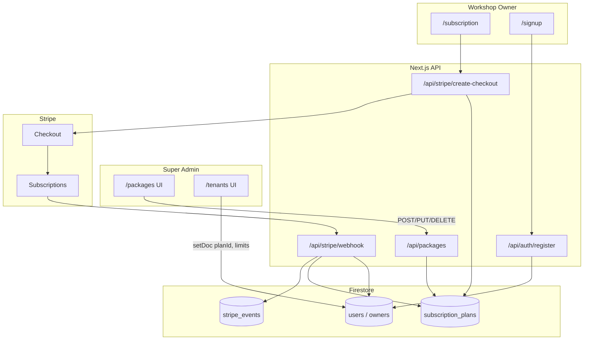

# Subscription System — Architecture & Data Flow

This folder is the documentation home for everything related to **subscription plans and billing** in the BMS Pro Black Admin Panel. The actual application code lives across `app/`, `lib/`, and `components/` (see file index below).

---

## Quick summary

| Concept | Where it lives |
|--------|----------------|
| **Plan catalog** (what you sell) | Firestore collection `subscription_plans` |
| **SMS add-on catalog** (bundled or top-up) | Firestore collection `sms_packages` |
| **Per-tenant subscription state** (who is on what plan, Stripe IDs, trial, limits) | Fields on `users/{uid}` (mirrored to `owners/{uid}` when that doc exists) |
| **Per-tenant SMS balance** (bundled + top-up) | Fields on `users/{uid}` (`smsMessageLimit`, `smsMessagesUsed`, `smsBundleQuota`, …) |
| **Stripe webhook idempotency** | Firestore collection `stripe_events` |
| **Super admin creates/edits plans** | UI: `/packages` → API: `/api/packages` (optional **Bundled SMS package**) |
| **Super admin onboards tenants with a plan** | UI: `/tenants` (writes directly to `users`, grants bundled SMS when linked) |
| **Workshop owner pays / upgrades** | UI: `/subscription` → Stripe Checkout → `/api/stripe/webhook` (SMS renews with period) |

There is **no** Firestore collection named `subscriptions` or `businesses`. Plans are catalog documents; live subscription and SMS balance live on each workshop owner’s `users/{uid}` document.

**Two kinds of SMS credits:**

| Type | Source | Renews with plan? |
|------|--------|-------------------|
| **Bundled** | Plan’s `smsPackageId` → granted at onboard, renewal, plan change | **Yes** |
| **Top-up** | Owner buys on `/sms` | **No** — extras above the bundle are preserved on renewal |

---

## Folder location

```
subscription/
└── readme/
    └── README.md   ← you are here
```

Related runtime code is **not** inside this folder. Use this README as the map.

---

## Firestore collections

### 1. `subscription_plans` — plan catalog

Created and managed by **super admin** via the Packages page. Each document is one sellable package.

**Security rules** (`firestore.rules`):

- `read`: public (`allow read: if true`) — signup and marketing can list plans
- `write`: any signed-in user (API routes use Admin SDK; UI uses authenticated super admin)

**Document fields** (set in `app/api/packages/route.ts`):

| Field | Type | Description |
|-------|------|-------------|
| `name` | string | Display name (e.g. "Solo", "Team 5") |
| `price` | number | Numeric price in AUD |
| `priceLabel` | string | Display label (e.g. `AU$49/week`) |
| `branches` | number | Branch limit (`-1` = unlimited) |
| `staff` | number | Staff limit (`-1` = unlimited) |
| `features` | string[] | Bullet list for UI |
| `popular` | boolean | Highlight on pricing cards |
| `color` | string | UI theme token |
| `image` / `icon` | string | Plan artwork |
| `active` | boolean | Inactive plans are hidden from public flows |
| `hidden` | boolean | Active but not shown on `/subscription` or public signup (custom/budget plans) |
| `stripePriceId` | string? | Optional Stripe Price ID for webhook plan matching |
| `trialDays` | number | Free trial length (0 = no trial) |
| `plan_key` | string? | Internal key (e.g. `SOLO`, `TEAM5`) |
| `billingCycle` | `"weekly"` \| `"monthly"` | Normalized on save |
| `validityDays` | number | Renewal interval in days (7 weekly, 28 monthly) — from `lib/subscriptionPlans.ts` |
| `smsPackageId` | string \| null | **Optional** link to bundled `sms_packages/{id}` |
| `createdAt`, `updatedAt` | timestamp | Audit |

**Bundled SMS selection (create/edit plan):**

- Super admin opens `/packages` → New/Edit Package → **Plan Settings** → **Bundled SMS package** dropdown.
- Options come from `GET /api/sms-packages` (all packages).
- Choose **“No bundled SMS package”** → `smsPackageId: null`.
- Choose a package → plan stores `smsPackageId` pointing at `sms_packages/{id}`.
- Granting at onboard/renewal only succeeds if the linked package is still **`active`**.

```
subscription_plans/{planId}
  smsPackageId: "abc123"
       │
       ▼
sms_packages/{abc123}
  messageQuota: 200   ← credits granted when plan is applied
```

**Example path:** `subscription_plans/{autoGeneratedId}`

---

### 2. `users` — per-tenant subscription state

When a workshop owner signs up or pays, subscription **state** is written on their `users/{uid}` document (not a separate subscriptions collection).

**Plan selection fields** (set at registration or by super admin):

| Field | Description |
|-------|-------------|
| `plan` | Plan display name |
| `planId` | `subscription_plans` document ID |
| `plan_key` | Internal plan key |
| `price` | Price label string |
| `branchLimit` / `staffLimit` | Enforced limits from plan |
| `currentBranchCount` / `currentStaffCount` | Usage counters |

**SMS fields** (bundled + top-up; same document — no `businesses` collection):

| Field | Purpose |
|-------|---------|
| `smsPackageId` / `smsPackage` | Linked package id + snapshot |
| `smsMessageLimit` / `smsMessagesUsed` | Total allowance and usage (`limit < 0` = unlimited) |
| `smsBundleQuota` | Bundled portion of the limit (top-ups sit **above** this) |
| `smsBundleRenewsWithPlan` | `true` when granted from a plan |
| `smsBundleGrantedAt` / `smsBundleRenewedAt` | First grant / last re-grant |
| `smsBundlePeriodEnd` | When bundled SMS renews (aligned with subscription period) |

**Remaining** = `smsMessageLimit − smsMessagesUsed` (or unlimited). Not stored as its own field.

Helpers: `lib/sms-packages/bundled.ts` (`buildTenantSmsFields`, `buildTenantSmsRenewalFields`) and `lib/sms-packages/server.ts` (`resolveSmsPackageForPlan`).

**Billing / Stripe fields** (set by Stripe webhook and billing APIs):

| Field | Description |
|-------|-------------|
| `stripeCustomerId` | Stripe Customer ID |
| `stripeSubscriptionId` | Stripe Subscription ID |
| `stripePriceId` | Current Stripe Price ID |
| `subscriptionStatus` | Stripe status: `trialing`, `active`, `past_due`, `canceled`, etc. |
| `billing_status` | App billing gate: `trialing`, `active`, `pending`, `past_due`, `suspended`, `cancelled` |
| `accountStatus` | `active`, `active_trial`, `pending_payment`, `suspended`, etc. |
| `status` | Human-readable status string |
| `trial_start`, `trial_end`, `trialDays`, `hasFreeTrial` | Trial tracking |
| `currentPeriodStart`, `currentPeriodEnd` | Billing period |
| `cancelAtPeriodEnd` | Scheduled cancellation |
| `grace_until` | Grace period after failed payment (3 days) |
| `lastPaymentDate`, `lastPaymentAmount`, `last_invoice_id` | Payment history |
| `downgradeScheduled`, `downgradePlanId`, … | Scheduled downgrade metadata |

The webhook helper `updateUserBilling()` in `app/api/stripe/webhook/route.ts` updates **both** `users/{uid}` and `owners/{uid}` when the owner doc exists.

---

### 3. `stripe_events` — webhook idempotency

Each processed Stripe event ID is stored so duplicate webhooks are skipped.

---

## URLs (pages)

| URL | Who | Purpose |
|-----|-----|---------|
| `/packages` | Super admin only | Create, edit, delete `subscription_plans`; manually change a tenant’s plan label |
| `/tenants` | Super admin only | Onboard workshop owners and assign a plan at creation |
| `/subscription` | Workshop owner | View plans, upgrade/downgrade, open Stripe Checkout |
| `/subscription/success` | Workshop owner | Post-checkout success (verifies session) |
| `/subscription/cancel` | Workshop owner | Checkout cancelled |
| `/signup` | Public | Self-registration; picks plan from public API |
| `/billing` | Workshop owner | Billing overview and portal |

Super admin sidebar links: **Packages** (`/packages`), **Tenants** (`/tenants`).  
Workshop owner sidebar: **Subscription** (`/subscription`).

`components/AuthGuard.tsx` allows super admins on `/packages` among other admin routes.

---

## API routes

| Method | URL | Auth | Purpose |
|--------|-----|------|---------|
| `GET` | `/api/packages` | Bearer token | List all plans (ordered by price) |
| `POST` | `/api/packages` | Bearer token | **Create** plan → `subscription_plans.add()` |
| `PUT` | `/api/packages` | Bearer token | Update plan |
| `DELETE` | `/api/packages?id={planId}` | Bearer token | Delete plan |
| `GET` | `/api/packages/public` | None | Active, non-hidden plans for signup |
| `POST` | `/api/auth/register` | None | Self-signup; writes plan fields on new `users` doc |
| `POST` | `/api/stripe/create-checkout` | Bearer token | Stripe Checkout session for `planId` |
| `POST` | `/api/stripe/webhook` | Stripe signature | Sync Stripe → `users` |
| `POST` | `/api/stripe/verify-session` | Bearer token | Confirm checkout after redirect |
| `POST` | `/api/stripe/create-portal` | Bearer token | Stripe Customer Portal |
| `GET` | `/api/billing/status` | Bearer token | Current billing snapshot for UI |
| `POST` | `/api/billing/upgrade` | Bearer token | Upgrade plan via Stripe |
| `POST` | `/api/billing/downgrade` | Bearer token | Schedule downgrade |
| `POST` | `/api/billing/cancel` | Bearer token | Cancel subscription |
| `POST` | `/api/trial/check-expiration` | Cron secret (optional) | Expire trials, notify before expiry |

---

## How super admin creates a subscription plan

This is the main “create subscription collection document” flow.

```
Super Admin logs in
    → document exists in super_admins/{uid}
    → opens /packages
    → clicks Create Package, fills form
    → Plan Settings: optional Bundled SMS package dropdown (from GET /api/sms-packages)
    → optional: uploads image to Firebase Storage (packages/{timestamp}_{filename})
    → POST /api/packages with Authorization: Bearer {idToken} (includes smsPackageId)
    → API verifies Firebase ID token
    → normalizes billingCycle → validityDays (lib/subscriptionPlans.ts)
    → adminDb().collection("subscription_plans").add(planData)
    → returns { id, plan }
    → UI refreshes GET /api/packages (enriched with bundledSmsPackage)
```

**Entry point UI:** `app/packages/page.tsx`  
**API:** `app/api/packages/route.ts` (POST handler)  
**Helpers:** `lib/subscriptionPlans.ts`, `lib/sms-packages/server.ts` (`enrichPlansWithBundledSms`)

**Access control on `/packages`:**

1. `onAuthStateChanged` → must have `super_admins/{uid}` doc
2. If not super admin → redirect to `/dashboard`

**Super admin can also assign a plan to an existing tenant** without Stripe:

- **`/packages`:** select tenant → `updateDoc(users/{tenantId}, { plan, price })` + audit log
- **`/tenants`:** create tenant or edit tenant → sets `planId`, `plan_key`, `branchLimit`, `staffLimit`, trial fields, and grants/renews bundled SMS when the plan has an active `smsPackageId`

Audit: `logTenantPlanChanged()` → `superAdminAuditLogs` with `entityType: "subscription"`.

---

## Bundled SMS grant & renewal

Uses existing collections only (`subscription_plans`, `sms_packages`, `users`). No new collections.

### First grant (onboarding / new tenant)

`buildTenantSmsFields(pkg)` writes onto `users/{ownerUid}`:

```
smsPackageId, smsPackage snapshot
smsMessageLimit   = pkg.messageQuota
smsMessagesUsed   = 0
smsBundleQuota    = pkg.messageQuota
smsBundleRenewsWithPlan = true
smsBundleGrantedAt / smsBundlePeriodEnd
```

Call sites: `POST /api/auth/register`, `/tenants` create.

### Renewal / plan change (preserve top-ups)

`buildTenantSmsRenewalFields(pkg, tenantData)`:

```
purchasedExtra = max(0, smsMessageLimit − smsBundleQuota)
newLimit       = newBundleQuota + purchasedExtra
smsMessagesUsed = 0
smsPackageId restored from the plan’s package
```

Call sites: Stripe `invoice.payment_succeeded`, checkout completed, subscription plan change, `/api/billing/upgrade`, `/tenants` edit when plan changes.

If the plan has **no** `smsPackageId`, or the linked package is **inactive**, subscription period still updates but **SMS fields are left unchanged**.

Full outbound SMS / top-up docs: `docs/sms-packages/README.md`.

---

## How workshop owners get a subscription

### Path A — Super admin creates tenant (`/tenants`)

```
Super admin completes 3-step modal
    → selects package from GET /api/packages
    → creates Firebase Auth user (secondary app)
    → setDoc(users/{ownerUid}, { planId, plan, branchLimit, staffLimit, trial fields, bundled SMS fields, ... })
    → welcome email with link to /subscription for payment (if no trial)
```

No Stripe yet until the owner completes checkout.

### Path B — Self signup (`/signup`)

```
User picks plan from GET /api/packages/public
    → POST /api/auth/register { planId, planName, planPrice, planKey, planBranches, planStaff, trialDays, ... }
    → Admin SDK creates Auth user + users/{uid} with plan fields
    → client signs in → redirected to pay or use trial
```

### Path C — Pay / upgrade (`/subscription`)

```
Workshop owner opens /subscription
    → GET /api/packages (filters active, non-hidden)
    → GET /api/billing/status
    → selects plan → POST /api/stripe/create-checkout { planId }
    → reads subscription_plans/{planId}
    → creates/uses stripeCustomerId on users doc
    → Stripe Checkout (recurring interval = validityDays)
    → success → /subscription/success
    → Stripe webhook checkout.session.completed
    → updates users: stripeSubscriptionId, billing_status, planId, limits, etc.
```

**Checkout metadata** passed to Stripe (used by webhook):

- `firebaseUid`, `planId`, `planName`, `plan_key`, `billingCycle`, `validityDays`

---

## Stripe webhook → user document sync

**File:** `app/api/stripe/webhook/route.ts`

| Event | Effect on `users` |
|-------|-------------------|
| `checkout.session.completed` | Save Stripe IDs, set `billing_status`, sync plan from `subscription_plans` by `stripePriceId` or metadata |
| `invoice.payment_succeeded` | `billing_status: active`, update period dates, sync limits from plan |
| `invoice.payment_failed` | `billing_status: past_due`, `grace_until` + 3 days |
| `customer.subscription.updated` | Sync period, trial, plan limits on price change |
| `customer.subscription.deleted` | `billing_status: cancelled`, `accountStatus: suspended` |

Plan lookup order when price changes:

1. `subscription_plans` where `stripePriceId == priceId`
2. Else Stripe Price `metadata.planId` → `subscription_plans/{planId}`

---

## Data flow diagram



---

## How limits are enforced

Plans define `branches` and `staff` on `subscription_plans`. These are copied to `branchLimit` and `staffLimit` on the user when:

- Tenant is created (super admin or register)
- Stripe webhook syncs after payment or plan change

Consumers:

- `app/branches/page.tsx` — reads `subscription_plans` via `planId` for branch cap
- `app/staff/manage/page.tsx` — staff cap from user limits
- `components/AuthGuard.tsx` — loads plan by `planId` for access checks

`-1` means unlimited.

---

## Supporting libraries & UI

| File | Role |
|------|------|
| `lib/subscriptionPlans.ts` | Billing cycle normalization, validity days, card labels |
| `lib/sms-packages/bundled.ts` | Bundled SMS first-grant and renewal field builders |
| `lib/sms-packages/server.ts` | `resolveSmsPackageForPlan`, enrich plans with SMS |
| `components/BillingStatusBanner.tsx` | Shows billing warnings |
| `components/TrialWarningBanner.tsx` | Trial expiry warnings |
| `components/PaymentRequiredModal.tsx` | Blocks actions when payment required |
| `components/OwnerAccountInactiveModal.tsx` | Suspended account messaging |
| `app/admin-dashboard/page.tsx` | Super admin MRR / plan distribution from tenant `users` data |

---

## Complete file index (subscription-related)

### Documentation (this folder)

- `subscription/readme/README.md`

### Plan catalog (super admin)

- `app/packages/page.tsx` — Packages UI (CRUD + bundled SMS select + tenant plan override)
- `app/api/packages/route.ts` — CRUD for `subscription_plans` (`smsPackageId` optional)
- `app/api/packages/public/route.ts` — Public plan list
- `lib/subscriptionPlans.ts` — Billing cycle helpers
- `lib/sms-packages/bundled.ts` — Bundled SMS grant/renewal fields
- `app/sms-packages/page.tsx` — SMS catalog (what can be bundled or sold as top-up)

### Tenant onboarding (super admin)

- `app/tenants/page.tsx` — Create/edit tenants with `planId`
- `lib/auditLog.ts` — `logTenantPlanChanged()`

### Workshop owner billing UI

- `app/subscription/page.tsx`
- `app/subscription/success/page.tsx`
- `app/subscription/cancel/page.tsx`
- `app/billing/page.tsx`
- `app/signup/page.tsx`

### Stripe & billing APIs

- `app/api/stripe/create-checkout/route.ts`
- `app/api/stripe/webhook/route.ts`
- `app/api/stripe/verify-session/route.ts`
- `app/api/stripe/create-portal/route.ts`
- `app/api/billing/status/route.ts`
- `app/api/billing/upgrade/route.ts`
- `app/api/billing/downgrade/route.ts`
- `app/api/billing/cancel/route.ts`

### Registration & trials

- `app/api/auth/register/route.ts`
- `app/api/trial/check-expiration/route.ts`
- `app/api/cron/suspend-overdue/route.ts` — Suspends after grace period

### Access control & enforcement

- `components/AuthGuard.tsx`
- `components/Sidebar.tsx`
- `app/branches/page.tsx`
- `app/staff/manage/page.tsx`

### Security rules

- `firestore.rules` — `subscription_plans`, `users`, `super_admins`

---

## Environment variables

| Variable | Used for |
|----------|----------|
| `STRIPE_SECRET_KEY` | Checkout, webhook, billing APIs |
| `STRIPE_WEBHOOK_SECRET` | Webhook signature verification |
| `NEXT_PUBLIC_APP_URL` | Checkout redirect URLs |
| `NEXT_PUBLIC_BOOKING_ENGINE_URL` | Tenant booking links at signup |
| `CRON_SECRET` | Optional protection for trial/cron endpoints |

---

## Common operations (cheat sheet)

**Create a new plan (super admin):**  
`/packages` → Create Package → save → document appears in `subscription_plans`.

**Assign plan to new tenant without payment:**  
`/tenants` → Add tenant → step 3 select package → creates `users/{uid}` with `planId` and limits.

**Owner pays for plan:**  
Owner logs in → `/subscription` → Select plan → Stripe → webhook updates `users`.

**Hide a custom plan from public pricing:**  
Edit package → set `hidden: true` (still assignable in super admin tenants edit).

**Deactivate a plan:**  
Edit package → `active: false` (excluded from public and subscription upgrade lists).
